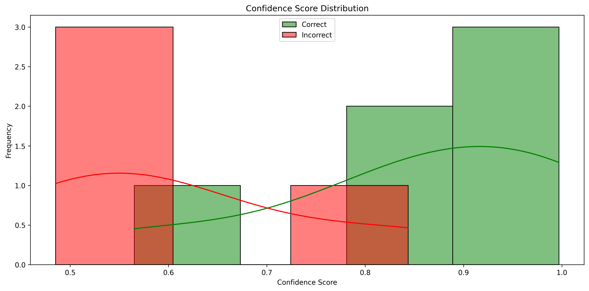
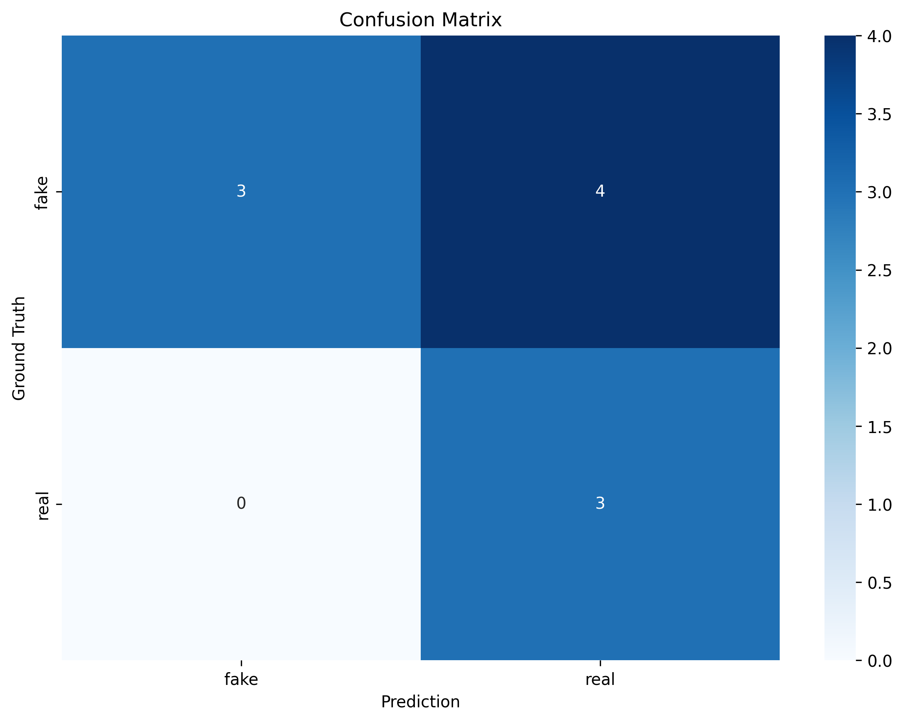
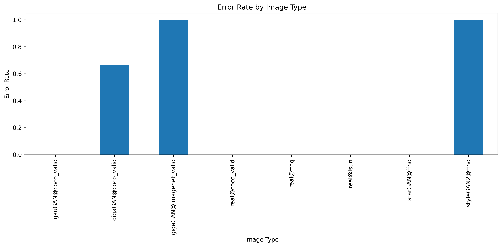

# Training Code README

## 1. Installation

### Set up a Conda Environment

1. Create a new conda environment:
    ```sh
    conda create -n clip-svm python=3.8
    ```

2. Activate the environment:
    ```sh
    conda activate clip-svm
    ```

3. Install the required packages:
    ```sh
    pip install -r requirements.txt
    ```

## 2. Required Input Files

### Example of `train.csv`


| id     | image_id | caption                                      | filename0                                | filename1                                 |
|--------|----------|----------------------------------------------|------------------------------------------|-------------------------------------------|
| 602744 | 198775   | A small car in a small parking space.        | coco2017/train2017/000000198775.jpg      | coco_latent_t2i/train2017/ann000000602744.png |
| 673165 | 257036   | A cat sits atop a night stand next to a bike.| coco2017/train2017/000000257036.jpg      | coco_latent_t2i/train2017/ann000000673165.png |


### Example of `validation.csv`

### Example of `validation.csv`
| filename            | source           | score0              | score1              | score2              |
|---------------------|------------------|---------------------|---------------------|---------------------|
| 105_20353.png       | gigaGAN@imagenet | 0.48518780679795825 | 0.48518780679795825 | 0.5148121932020417  |
| 000000393056.png    | gauGAN@coco_valid| 0.9969943419168     | 0.003005658083200057| 0.9969943419168     |
| ...                 | ...              | ...                 | ...                 | ...                 |

**Note:** The label is retrieved based on the source. If the source includes "real", the label is considered as real; otherwise, it is considered as fake.

## 3. Configuration File

### Modify the Configuration

The configuration is defined in [`experiments/train_config.py`](experiments/train_config.py ). Ensure the paths to the training and validation CSV files are correct.

### Image Retrieval

Images are retrieved using the `base_dir` combined with `filename0` or `filename1` from the CSV files. Ensure that the paths specified in the CSV files are relative to the `base_dir`.

For example:
- Training image path: `os.path.join(self.base_dir, filename0)`
- Validation image path: `os.path.join(self.base_dir, filename1)`

```py
class TrainConfig:
    def __init__(self):
        self.project_root = "/path/to/ClipBased-SyntheticImageDetection"
        self.train_csv = os.path.join(self.project_root, "data/train.csv")
        self.val_csv = os.path.join(self.project_root, "data/validation.csv")
        self.base_dir = os.path.join(self.project_root, "data")
        self.output_dir = os.path.join(self.project_root, "outputs")
        self.batch_size = 2
        self.device = "cuda"
        self.debug = True
```

## 4. Running the Training Code

1. Navigate to the [`experiments`](experiments ) directory:
    ```sh
    cd experiments
    ```

2. Run the training script:
    ```sh
    PYTHONPATH=.. python train_clip_svm.py
    ```

### What the Training Script Does

- Loads the training and validation datasets.
- Extracts features using the CLIP model.
- Performs hyperparameter tuning with cross-validation.
- Saves the training and validation metrics to [`outputs/metrics.csv`](outputs/metrics.csv ).
- Saves the best model weights to [`outputs/svm_model.joblib`](outputs/svm_model.joblib ).

## 5. Generating Plots

1. Run the analysis script:
    ```sh
    python inspect/analyze_result.py
    ```

### Output Plots

The plots will be saved in the [`outputs/plots`](outputs/plots ) folder. Below is an example of a confusion matrix:


*Figure 1: Confidence Distribution - This chart shows the distribution of confidence scores for the model's predictions. It helps in understanding how confident the model is in its predictions across different classes.*


*Figure 2: Confusion Matrix - This matrix visualizes the performance of the classification model by showing the number of correct and incorrect predictions for each class. It helps in identifying which classes are being confused with each other.*


*Figure 3: Error Rate by Type - This chart displays the error rate for each type of prediction error. It helps in identifying specific types of errors that the model is making, which can be useful for further model improvement.*


## 6. Inference

1. Navigate to the [`experiments`](experiments ) directory:
    ```sh
    cd experiments
    ```

2. Run the prediction script:
    ```sh
    PYTHONPATH=.. python predict_clip_svm.py
    ```

### What the Prediction Script Does

- Loads the validation dataset.
- Extracts features using the CLIP model.
- Makes predictions using the trained SVM model.
- Saves the predictions to [`outputs/predictions.csv`](outputs/predictions.csv ).

**Note:** The `predicted_label` column contains the model's prediction for each image, and the `confidence_score` column indicates the confidence level of the prediction.
### Example of `detailed_predictions.csv`

| filename            | prediction | ground_truth | image_type | confidence | prob_real | prob_fake |
|---------------------|------------|--------------|------------|------------|-----------|-----------|
| 105_20353.png       | fake       | real         | synthetic  | 0.85       | 0.15      | 0.85      |
| 000000393056.png    | real       | real         | real       | 0.95       | 0.95      | 0.05      |
| ...                 | ...        | ...          | ...        | ...        | ...       | ...       |

**Note:** The `prediction` column contains the model's prediction, `ground_truth` is the actual label, `image_type` indicates whether the image is synthetic or real, `confidence` is the confidence level of the prediction, and `prob_real` and `prob_fake` are the probabilities of the image being real or fake, respectively.


## Commands

### Training

```sh
PYTHONPATH=.. python train_clip_svm.py
```

### Prediction

```sh
PYTHONPATH=.. python predict_clip_svm.py
```